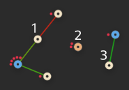

# ff-mesh-metrics

A small program that parses graph.json from ffmap-backend and outputs some metrics.

## How to build

* Install [Stack][]
* Execute `stack build`

[Stack]: http://docs.haskellstack.org/en/stable/README.html

## How to use

Here is an example for how to integrate the data from this program into graphite,  
using the carbon plaintext protocol. Requires `jshon` and `nc` (netcat).

```bash
#!/bin/bash

binPath="/somewhere/ff-mesh-metrics/.stack-work/install/x86_64-linux/lts-5.1/7.10.3/bin"
jsonPath="/somewhere/ffmap-backend/data"
wspPath="ffxy.globalstats"
carbonHost="localhost"
carbonPort="2003"

jsonData=$("$binPath/ff-mesh-metrics" < "$jsonPath/graph.json")
carbonInput=""

for attr in $(jshon -k <<< "$jsonData"); do
	value=$(jshon -e $attr <<< "$jsonData")
	timestamp=$(date +%s)
	# If you have the data from 1 minute ago because this runs as an independent
	# cron job instead of waiting for the current data to be available
	#timestamp=$(($(date +%s) - 60))
	carbonInput+="$wspPath.$attr $value $timestamp"$'\n'
done

nc -q0 $carbonHost $carbonPort <<< "$carbonInput"
```

## How is this 'Mesh rate' calculated?

- If there are less than 2 nodes, it's undefined (null in the json output)
- Otherwise, it is `(nodes - subnets) / (nodes - 1)`

Where subnets is the amount of physically independent nodes or meshes. If that description
doesn't make much sense to you, here is a graphic of 7 nodes forming 3 subnets. The mesh
rate here would be 66.66%.


